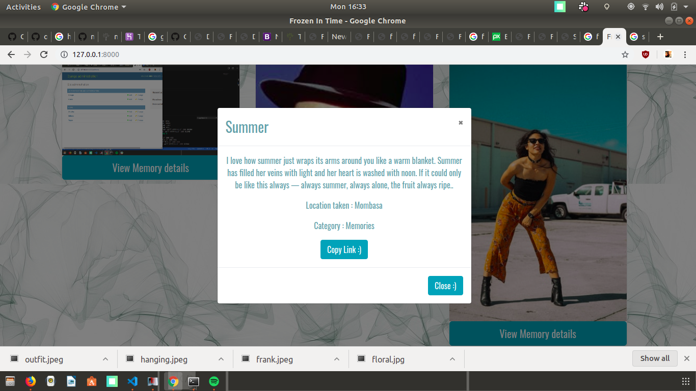

# Frozen In Time

Frozen in Time is an online gallery build on Python's Django Framework that enables users to store images , document their memories and view images according to how categories and locations.

## Getting Started/Setup

* `git clone this repo https://github.com/Janice-M/frozenInTime.git`

##### Create a virtual
* Creating Virtualenv - unlimited virtual
* `sudo apt-get install python3-pip`
* ` pip3 install virtualenv`
* `virtualenv venv` (you can call it venv or anything you like)
* `source venv/bin/activate`

 Let virtual remain activated and then in virtual :

#### Install django 

* run `pip install django==1.11`
* Then run shell  by using `python3.6`
* `import django` in shell
* Then in virtual in terminal  create your django app `django-admin startproject newdjango`

#### Install dependencies 

`pip3 install -r requirements`

### Environment requirements 

* SECRET_KEY= added by default
* DEBUG= set to false in production
* DB_USER= database user of choice
* DB_PASSWORD= database of choice
* DB_HOST="127.0.0.1" on local
* MODE= dev or prod , set to prod during production
* ALLOWED_HOSTS='.localhost', '.herokuapp.com', '.127.0.0.1' 

## Running the tests

Run tests by running the following :

(venv)$ `python3.6 manage.py test photos`

### Break down into end to end tests

The tests will test the following features in the system :

*  Image Model
*  Location and Category models & methods in the models
*  Image Model Methods
*  Search Functionality
*  Image Details
*  Copy link functionality

### And coding style tests

The app does not need coding style tests according to its current scope

## Database Migration

Migrate using:

`python manage.py migrate `

## Running The Server on Your Local Host
`python manage.py runserver`

## Built With

* Django - Python Framework
* Vanilla Javascript
* HTML5
* Bootstrap 4 
* CSS

## Deployment 

Please read [Deploy to Heroku :)](hhttps://simpleisbetterthancomplex.com/tutorial/2016/08/09/how-to-deploy-django-applications-on-heroku.html) for details on our deployment of this app

## Authors

* **Jan-2019** - *Initial work* - [Grey Worm](https://github.com/Janice-M)

## License

This project is licensed under the MIT License - see the [LICENSE.md](LICENSE.md) file for details
